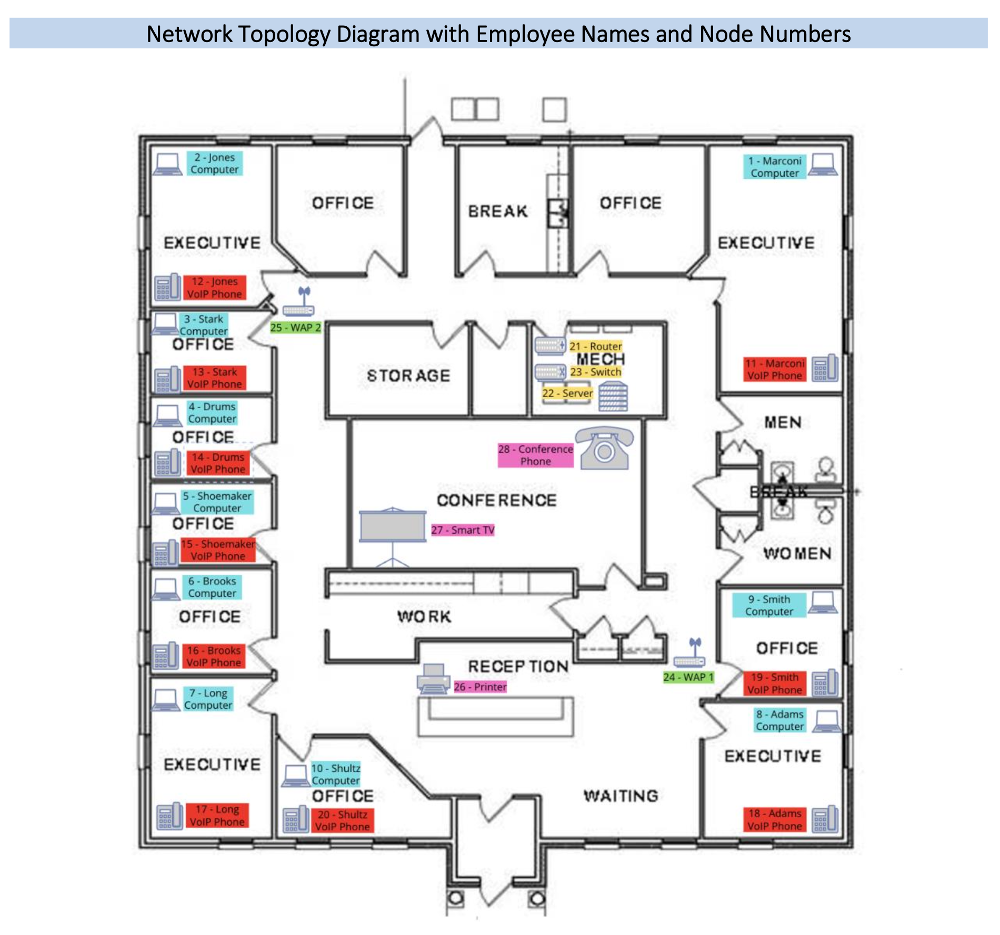

# Enterprise Network Design & Implementation

> A complete IT infrastructure design and deployment for a fictional law firm client, covering LAN design, IP planning, hardware procurement, Windows Server configuration, and user and group management, delivered on time and under a $60,000 budget.

---

## 📋 Table of Contents

- [Overview](#-overview)
- [Objectives](#-objectives)
- [Project Scope](#-project-scope)
- [Network Design](#-network-design)
- [Hardware Specifications](#-hardware-specifications)
- [Windows Server Configuration](#-windows-server-configuration)
- [Project Management](#-project-management)
- [Budget Summary](#-budget-summary)
- [Documentation](#-documentation)
- [Author](#-author)

---

## 📌 Overview

This project involves the complete design and implementation of a new IT infrastructure for Marconi Law Firm, LLC, a fictional law firm client based in Orlando, Florida. The firm was consolidating three offices across multiple floors into a single floor, requiring a full network buildout from the ground up.

The project covers network design, hardware selection and procurement, Windows Server 2022 configuration, user and group management, folder permissions, and full project documentation including timesheets, status reports, and a client presentation.

> **Note:** All credentials in this project are lab and demo credentials used in a simulated environment. They are not used in any production system.

---

## 🎯 Objectives

- Consolidate IT infrastructure from three offices into a single floor
- Design and implement a new Local Area Network with static IP addressing
- Procure and specify all necessary hardware and software within budget
- Configure Windows Server 2022 with user accounts, groups, and permissions
- Deliver comprehensive documentation and a client presentation
- Complete the project within five weeks and under a $60,000 budget

---

## 📂 Project Scope

### Deliverables

| Item | Quantity |
|------|----------|
| Laptops (Windows 11) | 10 |
| VoIP Phones | 10 |
| Server | 1 |
| Router | 1 |
| Switch | 1 |
| Wireless Access Points | 2 |
| Printer | 1 |
| Smart TV | 1 |
| Conference Phone | 1 |
| Windows Server 2022 Setup | 1 |

### Constraints

- **Time:** Five-week deadline to avoid disruption to firm operations
- **Budget:** $60,000 maximum
- **Resources:** Availability of skilled IT personnel
- **Shipping:** Hardware shipping timelines
- **Existing Infrastructure:** Integration with some existing equipment required

### Success Factors

- Meeting the five-week deadline
- Staying within the $60,000 budget
- Meeting all technical specifications
- Ensuring user satisfaction and hardware/software compatibility
- Maintaining high quality throughout the deployment

---

## 🔷 Network Design

### Subnet Information

| Setting | Value |
|---------|-------|
| Netmask | 255.255.255.0 |
| Network ID | 10.10.119.0 |
| First IP | 10.10.119.0 |
| Last IP | 10.10.119.255 |
| Total Hosts | 256 |

### IP Group Ranges

| Group | IP Range |
|-------|----------|
| Computers | 10.10.119.100 - 10.10.119.109 |
| VoIP Phones | 10.10.119.200 - 10.10.119.209 |
| Network Backbone | 10.10.119.1 - 10.10.119.3 |
| WAPs | 10.10.119.50 - 10.10.119.51 |
| Other (Printer, TV, Conference Phone) | 10.10.119.60 - 10.10.119.62 |

### Node IP Assignment

| Node | Hardware | Static IP |
|------|----------|-----------|
| 1 | Marconi Computer | 10.10.119.100 |
| 2 | Jones Computer | 10.10.119.101 |
| 3 | Stark Computer | 10.10.119.102 |
| 4 | Drums Computer | 10.10.119.103 |
| 5 | Shoemaker Computer | 10.10.119.104 |
| 6 | Brooks Computer | 10.10.119.105 |
| 7 | Long Computer | 10.10.119.106 |
| 8 | Adams Computer | 10.10.119.107 |
| 9 | Smith Computer | 10.10.119.108 |
| 10 | Schultz Computer | 10.10.119.109 |
| 21 | Router | 10.10.119.1 |
| 22 | Server | 10.10.119.2 |
| 23 | Switch | 10.10.119.3 |
| 24 | WAP 1 | 10.10.119.50 |
| 25 | WAP 2 | 10.10.119.51 |
| 26 | Printer | 10.10.119.60 |
| 27 | Smart TV | 10.10.119.61 |
| 28 | Conference Phone | 10.10.119.62 |

### Network Topology Diagram

---

## 💻 Hardware Specifications

| Hardware | Brand / Model | Key Specs |
|----------|--------------|-----------|
| Laptops | Lenovo ThinkPad T14 Gen 5 | AMD Ryzen 7 Pro 8840U, 32GB DDR5, 512GB NVMe SSD, Win 11 Pro |
| Server | HPE ProLiant DL380 Gen 11 | Intel Xeon Silver 4509Y, 64GB DDR5, 2x480GB SSD |
| Router | Ubiquiti EdgeRouter Infinity ER-8-XG | 16GB DDR4, 10GbE, IPv4/IPv6 |
| Switch | Ubiquiti UniFi USW-Enterprise-48-PoE | 48-port 2.5GbE PoE+, 176 Gbps capacity |
| WAPs | Ubiquiti UniFi U6 | WiFi 6E, 2.4/5/6 GHz, 10.2 Gbps |
| Printer | Brother MFC-L9670CDN | Color laser, 150K page duty cycle, Gigabit LAN |
| VoIP Phones | Cisco IP Phone 7861 | SIP/SRTP, 16 lines, PoE |
| Conference Phone | Grandstream GAC2570 | HD audio, AEC, VoIP |
| Smart TV | Samsung QN65S90DAF | 65" 4K OLED, Dolby Atmos |
| Server OS | Microsoft Windows Server 2022 Standard | 16-core license |

---

## 🔑 Windows Server Configuration

### User Accounts

Ten user accounts were created in Windows Server 2022 for all Marconi Law employees using the following process:

1. Launch Windows Server 2022 VM and log in with admin credentials
2. Open Server Manager and navigate to Computer Management
3. Create new users via Local Users and Groups
4. Assign usernames, full names, and passwords
5. Add users to appropriate groups
6. Test each account by logging in

### Groups

Three groups were created to simplify access management:

| Group | Members |
|-------|---------|
| _Attorneys | All attorney accounts |
| _Accounting | Brian Smith (Accountant) |
| _Administrative | Evelyn Schultz (Administrative Assistant) |

### Folder Permissions

Three shared folders were created with group-based permissions:

| Folder | Access Group |
|--------|-------------|
| Attorneys | _Attorneys |
| Accounting | _Accounting |
| Administrative | _Administrative |

Permissions were configured using the New Share Wizard in Computer Management, removing universal access and assigning group-specific permissions following the principle of least privilege.

---

## 📊 Project Management

The project was completed across four milestones over five weeks totaling 40 hours of labor.

| Milestone | Key Activities |
|-----------|---------------|
| Milestone 1 | Case study review, network diagram, hardware selection |
| Milestone 2 | Project scope, static IP assignment, network diagram finalization |
| Milestone 3 | User accounts, groups, folder permissions |
| Milestone 4 | Project report, LAN finalization, client presentation |

---

## 💰 Budget Summary

| Item | Unit Cost | Qty | Total |
|------|-----------|-----|-------|
| Laptops | $1,239.99 | 10 | $12,399.90 |
| Router | $2,019.99 | 1 | $2,019.99 |
| Server | $4,649.00 | 1 | $4,649.00 |
| Switch | $1,748.99 | 1 | $1,748.99 |
| Server Hard Drive | $391.99 | 1 | $391.99 |
| VoIP Phones | $311.99 | 10 | $3,119.90 |
| Conference Phone | $749.00 | 1 | $749.00 |
| WAPs | $303.99 | 2 | $607.98 |
| Printer | $1,399.99 | 1 | $1,399.99 |
| Smart TV | $2,699.99 | 1 | $2,699.99 |
| Windows Server 2022 | $969.99 | 1 | $969.99 |
| Labor | $125/hr | 40 hrs | $5,000.00 |
| Annual Maintenance | $15,000 | 1 yr | $15,000.00 |
| **Grand Total** | | | **$50,756.72** |

Project completed **$9,243.28 under the $60,000 budget.**

---

## 📄 Documentation

[View full network implementation report (PDF)](./Network_System_Implementation.pdf)

---

## 👤 Author

**Jarred Ward**

